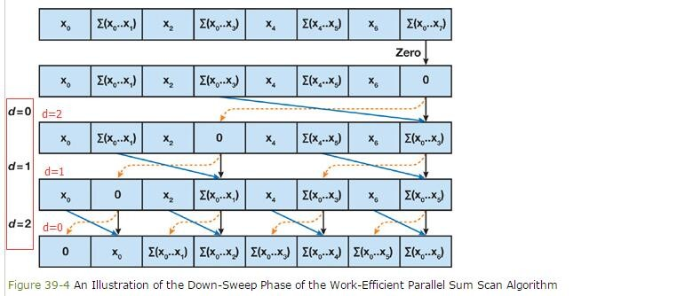
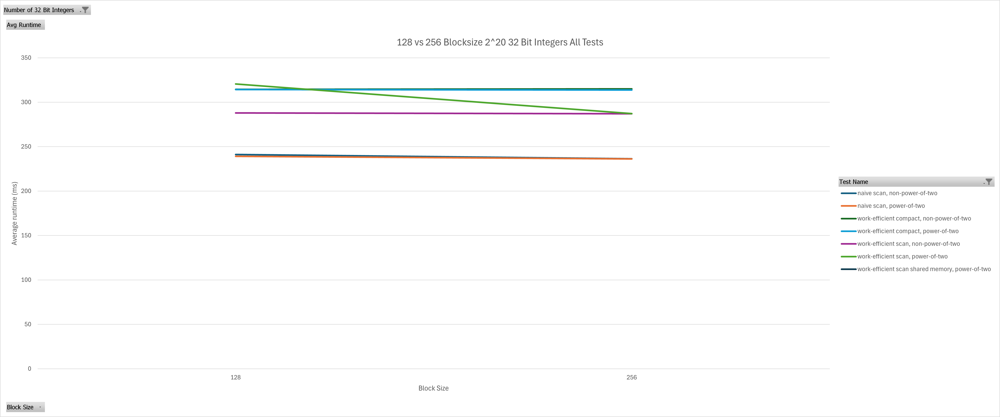
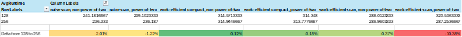
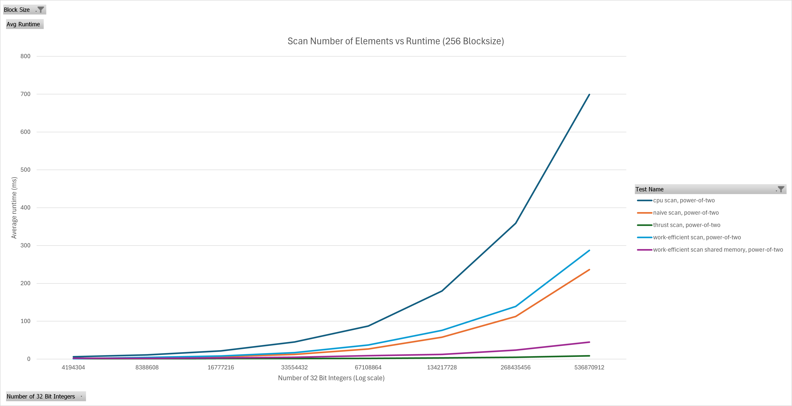
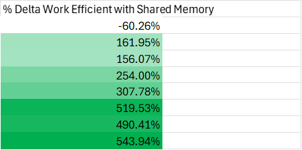
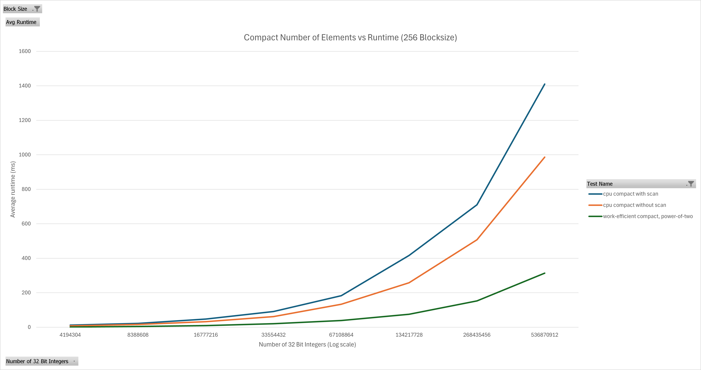
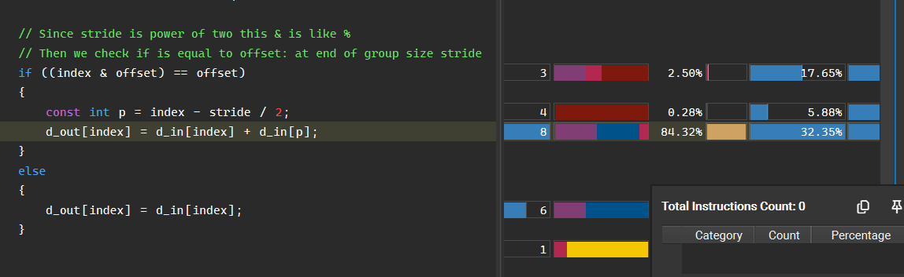
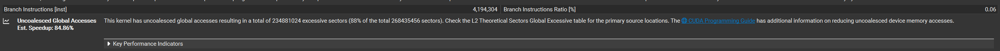
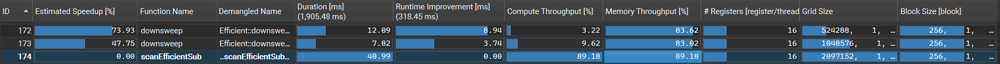
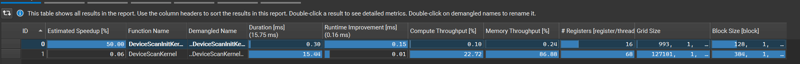

CUDA Stream Compaction
======================

**University of Pennsylvania, CIS 565: GPU Programming and Architecture, Project 2**

* Aaron Tian
  * [LinkedIn](https://www.linkedin.com/in/aaron-c-tian/), [personal website](https://aarontian-stack.github.io/)
* Tested on: Windows 22H2 (26100.6584), Intel Core Ultra 7 265k @ 3.90GHz, 32GB RAM, RTX 5070 12GB (release driver 581.15)

This projects implements parallel prefix scan (or prefix sum) and stream compaction algorithms using CUDA. The prefix scan is a classic reduction problem as the user may seek to quickly find the sum of all the elements in an array.

## Table of Contents

- [Implementation Details](#implementation-details)
  - [Parallel Prefix Sum (Scan)](#parallel-prefix-sum-scan)
    - [CPU](#cpu)
    - [Naive GPU](#naive-gpu)
    - [Work-Efficient GPU](#work-efficient-gpu)
    - [Work-Efficient GPU with Shared Memory](#work-efficient-gpu-with-shared-memory)
  - [Compaction](#compaction)
- [Performance Analysis](#performance-analysis)
  - [Block Size](#block-size)
  - [Scan](#scan)
  - [Compaction](#compaction-1)
  - [Nsight Capture](#nsight-capture)
    - [How does Thrust do scan so fast?](#how-does-thrust-do-scan-so-fast)
  - [Memory Spilling](#memory-spilling)
- [Further Potential Optimizations](#further-potential-optimizations)
- [Sample Output](#sample-output)

## Implementation Details

### Parallel Prefix Sum (Scan)

Given an array of `n` elements, a prefix sum produces an output array where each element at index `i` is the sum of all elements up to but not including index `i` in the input array (exclusive). There is also the inclusive version where the sum at index `i` includes the element at index `i` in the input array.

#### CPU

A simple for loop goes through each element. A running sum is written to the output array index at every iteration. The exclusive scan always sets the first element of the output array to 0 and only tracks the sum before the current index.

This algorithm is linear or O(n) in time complexity.

#### Naive GPU

A thread is launched for every element in the array. If the thread index matches the current iteration stride `s`, then the sum of the current element and the element `s` indices before it is written to the output array. Every pair of elements is added together when `s = 1`, every other two elements is added together when `s = 2`, etc. For every stride or iteration of this algorithm, a CUDA kernel is launched for that stride value. Thus log(n) kernel launches are required, as the stride doubles every iteration. If `n` is not a power of two, the array is padded to the next power of two with zeros.

Within each iteration, we add up to `n` elements, so the time complexity of this algorithm is O(n log n). While the work within the kernel is parallelized, each launch is serialized.


<sub>*Diagram from GPU Gems 3*</sub>

#### Work-Efficient GPU

To reduce the number of adds performed, we can perform the scan in two passes: an up-sweep and a down-sweep phase. The array now represents a balanced binary tree where each element is a node in the tree. The up-sweep phase does a partial sum for each of these nodes in the tree, with the total sum being stored in the root of the tree (the last element of the array). The down-sweep phase then traverses back down the tree, using the partial sums to fill in the correct prefix sums for each node.

The up-sweep is O(n) adds, and the down-sweep is O(n) adds and O(n) swaps, so the total time complexity is O(n).



<sub>*Diagram from GPU Gems 3*</sub>

#### Work-Efficient GPU with Shared Memory

This is similar to the regular work-efficient implementation, except shared memory is used to perform the scan instead of global memory. Since shared memory is limited in size, and is per block (can't communicate between blocks) the scan is performed on subarrays each of the size of the number of threads in the block (this is one kernel). After each block performs a scan on its subarray, the last element of each block (the total sum of that block) is written to a separate array. An exclusive scan is then performed on this smaller array of block sums. Finally, each of those numbers from the scan of block sums is added to each element in its corresponding subarray.

The benefits of using shared memory are twofold:
1. Shared memory is faster: we do less reads and writes to global memory. This is the biggest performance gain since this algorithm is memory-bound. In both the naive and work-efficient implementations, the only arithmetic each thread is doing is adding two numbers.
2. Less kernel launches: the bulk of the work is the one kernel for the partial scans of the original array. The exclusive scan on the block sums is technically a recursive operation (if there are more block sums than your threads per block you can't do the entire exclusive scan in one shared memory allocation), but since the array size is divided by the block size every iteration the number of kernel launches is still much less compared to the regular work-efficient implementation.

### Compaction

Given an array `a` of elements, write out all the elements in `a` that satisfy a certain condition into a new array `b` that preserves the order of elements in `a` and return the number of elements written to `b`. This is accomplished using three steps:

1. Criteria array
    - If the element satisfies the condition, write a 1/true to the criteria array at that index. Otherwise, write a 0/false.
2. Exclusive prefix sum scan on criteria array
3. "Scatter" elements to output array
    - For every index `i` in the criteria array, if the value is 1/true, write the element at `a[i]` to index `criteria[i]` in array `b`.

## Performance Analysis

Data and charts is located in `data.xlsx`. Timing data is collected using `std::chrono` and CUDA events for the CPU and GPU implementations respectively. The result is averaged over 3 runs for each test case. The same seed is used to generate random arrays between runs.

### Block Size



Looking at runtime across a couple different block sizes there does not seem to be a significant difference in performance between different block sizes, with the exception of work-efficient scan power-of-two. I would have liked to test more block sizes but I did not have time. Although 128 looks like the better option here, I forgot to update the block size when collecting the rest of the data and I don't have the time to redo everything.



### Scan



Looking at the runtimes for scans the runtime does grow with a larger number of input elements. The simple CPU implementation grows linearly in time as expected. Both naive and work-efficient GPU scans are faster than the CPU implementation, however the work-efficient scan is about the same as the naive scan and is actually slower for larger input sizes despite doing less arithmetic operations. I believe this is due to the overhead of launching more kernels.

The optimizations in my shared memory work-efficient scan makes a big difference and is much closer to the golden standard of Thrust's implementation. Notably in addition to the significantly reduced runtime, the shared memory implementation also scales better with larger input sizes, similar to Thrust.



Notice how the improvement delta grows with larger input sizes: this is the better scaling.

### Compaction



The work-efficient compact in above graph is NOT using my shared memory optimized scan implementation.

The GPU implementation of compaction is much faster than the CPU implementation. The CPU implementation that does not use scan is faster because it avoids allocating extra memory and needing to read/write to it. This graph resembles the same shape as the scan graph since that is the biggest part of the algorithm: the true/false array and scatter steps are very simple and there is not much to optimize as each respective kernel for those two steps is extremely simple.

### Nsight Capture

It is quite obvious that the main bottleneck in the scan and compaction algorithms is memory bandwidth. For the naive scan, a lot of time is spent on global memory read/write. The below line is where the stall happens:



And in the work-efficient scan, Nsight immediately points out uncoalesced memory access as a big issue.



It is tricky to say exactly how many cycles are saved between the regular work-efficient scan and the shared memory optimized version due to the whole algorithm being composed of multiple kernel launches that are listed separately in Nsight Compute, but it looks to be in the ballpark of billions of cycles. The throughput is higher regardless:



#### How does Thrust do scan so fast?

We can see in Nsight Compute that Thrust's scan implementation only uses two kernels. The chosen block size for the scan is an interesting 384 threads.



Although Thrust is open source, it is still tricky to understand exactly what optimizations are going on due to heavy use of templating in the library plus the fact most of the implementation lives in the separate CUB project. However when poking around a little in the source/SASS view in Nsight, I notice a couple things going on:

1. Some kind of vectorized load where 64 bits are loaded instead of 32:
```
LD.E.64.STRONG.GPU R40, desc[UR8][R6.64+0x100]
```
2. Warp level partial scan using shuffle instructions: 
```
SHFL.DOWN PT, R8, R41, 0x1, R6
```
It seems partial scans are done at the warp level using shuffle instructions to exchange data between threads in the same warp, which is probably faster than what I was doing at the block level using shared memory.

### Memory Spilling

A brief thought I had when doing this project was the amount of memory used, and how that might affect performance due to memory spilling. In my implementation of the naive and work-efficient scan (non shared memory version) there are two buffers allocated, one for input and output. With compact I allocate four buffers of `n` 32-bit integers. For large sizes of `n`, this takes a considerable amount of video memory. With `n=2^30` a single array of all these 32-bit integers is 4294967296 bytes or an entire 4GB of memory. So if you have an 8GB GPU, just two arrays would actually exceed the available memory (less than 8GB Is availble to applications due to system reserved memory).

In this situation, any allocation that cannot fit in video memory will spill to system memory (RAM). Thus any access or write to that memory will be much slower. How the OS decides to page the resource or part of the resource in and out of video memory will also affect performance significantly. Normally I would confirm this behavior with a GPUView trace but running on my machine with `n=2^30`:
```
==== work-efficient compact, power-of-two ====
GPU Memory: 10928.0MB free, 16384.0MB needed
Not enough memory, spilling may occur
   elapsed time: 243373ms    (CUDA Measured)
    passed
```

Note that I added a check to all the tests that uses `cudaMemGetInfo` to see how much video memory is available before the test and prints out a warning if the memory needed exceeds that value.

This test takes 243 seconds or **4 minutes** which is way too long to do a regular GPUView capture. My PC also freezes the entire time the test is running. But the fact that `n=2^29` only takes ~699ms makes it clear that spilling is a huge performance hit. Doubling the number of elements and exceeding available memory makes the performance over 347x slower which does not follow the previous trend as seen in my graphs.

In conclusion, managing your memory usage outside your CUDA kernels is another important aspect of performance optimization as well.

## Further Potential Optimizations

* Try more block sizes
* Allocate all memory for the shared memory work-efficient scan upfront instead of at each level of recursion
* Avoid bank conflicts in shared memory
* Revisit the kernel for the shared memory work-efficient scan and see if the code can be structured differently such that syncpoint(s) can be removed
* Reduce required memory usage

## Sample Output

I added tests for my shared memory efficient scan implementation.

```
****************
** SCAN TESTS **
****************
    [  27  18   0  17   6  18  48  41  28  46  43  35  17 ...  33   0 ]
==== cpu scan, power-of-two ====
   elapsed time: 710.774ms    (std::chrono Measured)
    [   0  27  45  45  62  68  86 134 175 203 249 292 327 ... 263634348 263634381 ]
==== cpu scan, non-power-of-two ====
   elapsed time: 717.883ms    (std::chrono Measured)
    [   0  27  45  45  62  68  86 134 175 203 249 292 327 ... 263634222 263634263 ]
    passed
==== naive scan, power-of-two ====
   elapsed time: 234.785ms    (CUDA Measured)
    passed
==== naive scan, non-power-of-two ====
   elapsed time: 236.986ms    (CUDA Measured)
    passed
==== work-efficient scan, power-of-two ====
   elapsed time: 281.94ms    (CUDA Measured)
    passed
==== work-efficient scan, non-power-of-two ====
   elapsed time: 291.378ms    (CUDA Measured)
    passed
==== work-efficient scan shared memory, power-of-two ====
   elapsed time: 42.067ms    (CUDA Measured)
    passed
==== work-efficient scan shared memory, non-power-of-two ====
   elapsed time: 41.7568ms    (CUDA Measured)
    passed
==== thrust scan, power-of-two ====
   elapsed time: 8.61258ms    (CUDA Measured)
    passed
==== thrust scan, non-power-of-two ====
   elapsed time: 8.0049ms    (CUDA Measured)
    passed

*****************************
** STREAM COMPACTION TESTS **
*****************************
    [   1   2   2   1   2   0   0   1   0   2   1   3   3 ...   3   0 ]
==== cpu compact without scan, power-of-two ====
   elapsed time: 1020.5ms    (std::chrono Measured)
    [   1   2   2   1   2   1   2   1   3   3   2   3   3 ...   1   3 ]
    passed
==== cpu compact without scan, non-power-of-two ====
   elapsed time: 983.886ms    (std::chrono Measured)
    [   1   2   2   1   2   1   2   1   3   3   2   3   3 ...   1   2 ]
    passed
==== cpu compact with scan ====
   elapsed time: 1692.15ms    (std::chrono Measured)
    [   1   2   2   1   2   1   2   1   3   3   2   3   3 ...   1   3 ]
    passed
==== work-efficient compact, power-of-two ====
   elapsed time: 310.965ms    (CUDA Measured)
    passed
==== work-efficient compact, non-power-of-two ====
   elapsed time: 314.569ms    (CUDA Measured)
    passed
```